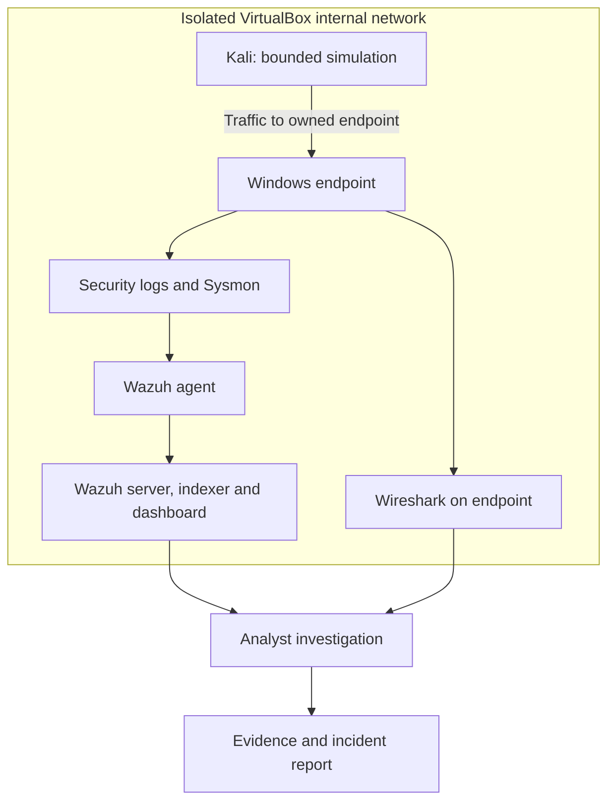

# SOC Home Lab — Threat Detection & Incident Investigation

A reproducible blue-team learning project: collect Windows telemetry, investigate controlled activity, and document decisions with evidence.

> **Current status: IMPLEMENTED — documentation and configuration examples. PLANNED — VM deployment, live detections, and investigations. No live lab evidence has been collected.**

## Overview

This repository provides the design and runbooks for a small SOC monitoring environment. It is an educational portfolio in progress, not a production deployment or employment experience. Start with the [setup guide](docs/setup-guide.md) and track actual execution in the [validation checklist](docs/validation-checklist.md).

## Objectives

- Trace an event from the endpoint to the SIEM.
- Distinguish an observation from an alert and a confirmed incident.
- Investigate four harmless simulations using host and network evidence.
- Explain false positives, gaps, and proportionate response decisions.

## Lab Architecture

See [network boundaries and ports](docs/architecture.md).

## Technologies Used

| Technology | Role |
| --- | --- |
| VirtualBox | Isolated virtual machines |
| Windows + Sysmon | Security and process telemetry |
| Wazuh | Collection, rules, alert search |
| Kali + Nmap | Bounded lab traffic generation |
| Wireshark | Packet inspection on the Windows endpoint |

## Environment

The full design uses three VMs: Windows, Kali, and a separate Wazuh all-in-one Linux VM. Budget roughly 16–24 GB host RAM as a planning estimate; 24 GB offers more headroom. An 8 GB host should start with the [reduced endpoint-only path](docs/setup-guide.md), leaving SIEM deployment planned. Software requires no paid SIEM or API subscription. Windows evaluation is time-limited and subject to Microsoft's terms; hardware is not provided.

## Detection Scenarios

| Runbook | Evidence target | Status |
| --- | --- | --- |
| [Failed authentication](detections/windows-authentication.md) | Security 4625 and SIEM search | PLANNED |
| [PowerShell](detections/powershell.md) | Script block 4104 + process metadata | PLANNED |
| [Network reconnaissance](detections/network-reconnaissance.md) | Bounded scan PCAP | PLANNED |
| [Unusual process](detections/unusual-process.md) | Parent-child execution context | PLANNED |

[Detection notes](detections/detection-notes.md) explain the limits of the supplied marker rules. [Queries](queries/useful-queries.md) include negative-control checks.

## Investigation Workflow

Establish scope → verify source telemetry → correlate host and time → test benign explanations → assess impact → document confidence and response. Use the [investigation methodology](docs/investigation-methodology.md).

## Incident Reports

- [SOC-LAB-001: illustrative failed-login report](incidents/incident-001-failed-logins.md) — **EXAMPLE, not an observed incident**.
- [Blank report template](incidents/incident-report-template.md).

## Skills Demonstrated

The repository currently demonstrates lab planning, defensive runbook writing, and detection design. Hands-on SIEM monitoring, alert triage, network analysis, and incident response remain learning objectives until backed by real captures and completed reports.

## Screenshots

**SCREENSHOT REQUIRED — none supplied.** The [capture checklist](screenshots/README.md) specifies five real screenshots and their future README placement. No fake images or broken image links are included.

## Lessons Learned

[Design lessons and learner reflection prompts](docs/lessons-learned.md) separate planning conclusions from experience still to be gained.

## Future Improvements

- Complete and document an end-to-end positive and negative test.
- Tune an authentication correlation rule from observed data.
- Add a network IDS only after understanding the PCAP and ingestion path.
- Record verified software versions and measured resource use.

## Ethical / Legal Disclaimer

Run only inside your owned, isolated lab. No malware, public targets, password lists, destructive payloads, or automated blocking are required. Do not publish secrets or raw personal logs. This project makes no claims about real attackers.

## Portfolio resources

[LinkedIn text](docs/linkedin-project-description.md) · [15 interview questions](docs/interview-questions.md) · [Sources](docs/references.md) · [GitHub publishing](docs/publish-to-github.md) · [Arabic quick start](docs/start-here-ar.md) · [Quality review](docs/quality-review.md)
