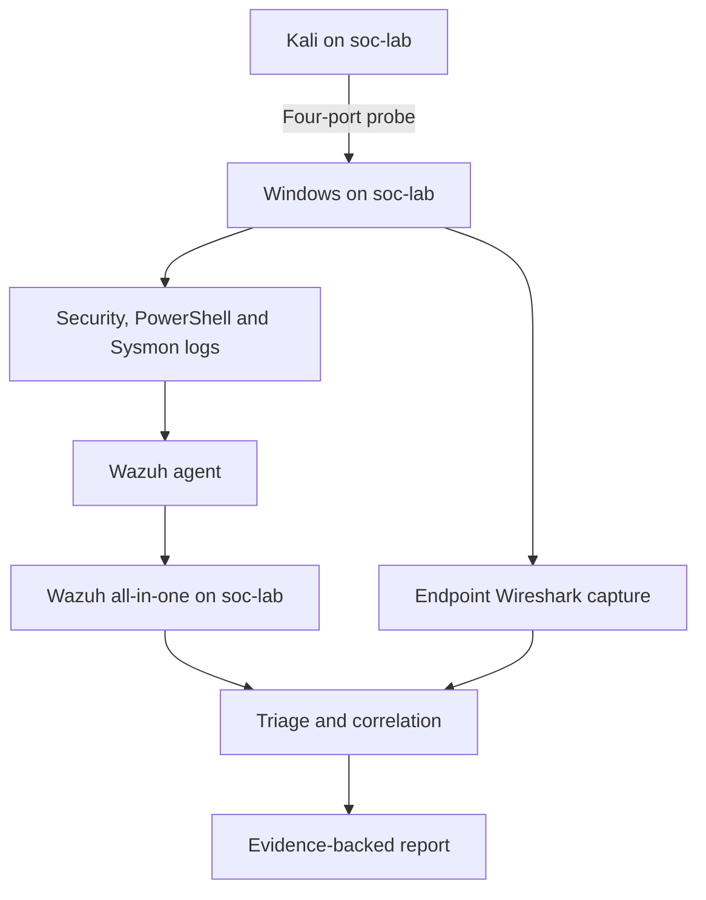

# Evidence paths

**PLANNED topology.**

Authentication and process exercises run locally on Windows. Only the network exercise needs Kali. No internet route is present during simulations. See [address and port plan](../docs/architecture.md).
